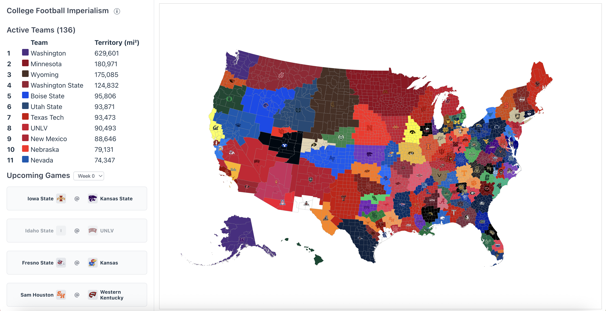

# College Football Imperialism Map

Interactive college football imperialism web app. Built for college football fans to visualize undefeated teams and simulate game outcomes. **Last updated: August 20, 2025.**



## 🏈 How It Works

- Teams start with the counties closest to their home stadium
- Winning teams take losing teams' land
- As the season progresses, defeated teams will be removed, leaving only undefeated teams
- FCS wins/losses do not count towards totals

## 🚀 Quick Start

```bash
npm install
npm run dev
```

## Stack

- **React 19** + TypeScript
- **D3.js** for map visualization
- **Vite** for build tooling

## Acknowledgments

### Concept
This project is inspired by the original College Football Imperialism Map by [Ryan P. Meyer](https://github.com/ryanpmeyer/CFBImperialism).

### Community Inspiration
Primarily inspired by the [r/CFB](https://www.reddit.com/r/CFB/) and this map (like the [2025 FBS Imperialism Map Preseason](https://imgur.com/a/2025-fbs-imperialism-map-preseason-zTlcklk)).

## 🤝 Contributing

This project is fully open source and welcomes contributions! Fork the repo and submit a pull request.

## 📄 License

MIT License - see below for details.

---

## MIT License

Copyright (c) 2025 David M. Hutchinson

Permission is hereby granted, free of charge, to any person obtaining a copy
of this software and associated documentation files (the "Software"), to deal
in the Software without restriction, including without limitation the rights
to use, copy, modify, merge, publish, distribute, sublicense, and/or sell
copies of the Software, and to permit persons to whom the Software is
furnished to do so, subject to the following conditions:

The above copyright notice and this permission notice shall be included in all
copies or substantial portions of the Software.

THE SOFTWARE IS PROVIDED "AS IS", WITHOUT WARRANTY OF ANY KIND, EXPRESS OR
IMPLIED, INCLUDING BUT NOT LIMITED TO THE WARRANTIES OF MERCHANTABILITY,
FITNESS FOR A PARTICULAR PURPOSE AND NONINFRINGEMENT. IN NO EVENT SHALL THE
AUTHORS OR COPYRIGHT HOLDERS BE LIABLE FOR ANY CLAIM, DAMAGES OR OTHER
LIABILITY, WHETHER IN AN ACTION OF CONTRACT, TORT OR OTHERWISE, ARISING FROM,
OUT OF OR IN CONNECTION WITH THE SOFTWARE OR THE USE OR OTHER DEALINGS IN THE
SOFTWARE.
